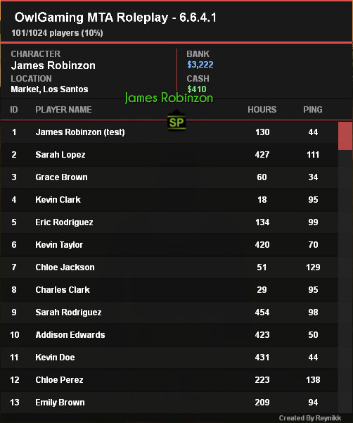

# 🧾 OwlGaming Enhanced Scoreboard

This project adds a **modern and customizable scoreboard** to the **OwlGaming** gamemode for **Multi Theft Auto: San Andreas (MTA:SA)** – designed for clarity, performance, and easy expansion.

## ✨ Features

- ✅ Modern UI  
- ✅ Displays player stats, character name, and ping   
- ✅ Optimized for roleplay environments  
- ✅ Easy integration with existing OwlGaming servers

## 📦 Installation

> ⚠️ **This addon assumes you already have a working OwlGaming server.**  
> I do **NOT provide support** for setting up OwlGaming itself.

1. Make sure your OwlGaming server is running properly.
2. Copy the `scoreboard` folder into your server’s `resources/` directory.
3. Add the resource to your `mtaserver.conf`:

   ```xml
   <resource src="scoreboard" startup="1" />
   ```

4. Restart your MTA server.

The scoreboard will now be active and accessible with the default key (Tab).

## 📸 Preview

### Screenshots

| With small amount of players | With big amount of players |
|-----------|----------------|
|  |  |

### Video

🎬 [Watch on YouTube](https://youtu.be/g3usiNfDMOs)  

## 🧠 Notes

- Designed specifically for the OwlGaming RP framework  
- Not tested with other gamemodes  

## 🙌 Credits

- Thanks to the OwlGaming community for their excellent gamemode  

## ☕ Support Me

If you find this addon helpful and want to support my work, you can do so here:  
👉 [https://paypal.me/brumicekcze](https://paypal.me/brumicekcze)

---

**Better visibility. Better RP. One glance is all it takes.**
